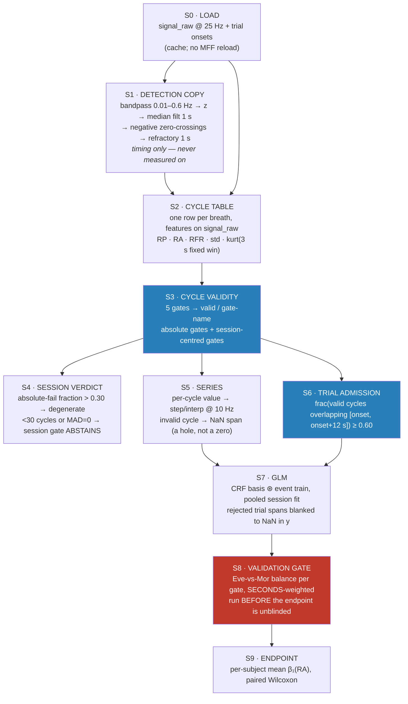

# Airflow pipeline — clean-slate design, cycle as the unit of rejection

Written 2026-08-10. Design proposal only; nothing in `Airflow/` was modified.
Every number below was computed by a prototype run over the **real Layer-1 cache**
(`airflow_output/_cache/airflow_cache.pkl`, 24 subjects, 47 sessions, 20604 breath
cycles). Scripts: `$CLAUDE_JOB_DIR/tmp/proto*.py`.

---

## 1. Stage diagram



The single structural commitment: **S3 is the only place a validity decision is
made.** S6 and S7 consume that decision; they never re-derive one from window
summary statistics. That is what makes rejection graded — a trial containing one
bad breath out of four is not the same object as a trial containing four.

---

## 2. What each stage needs

| stage | input | output | constants it needs |
|---|---|---|---|
| S0 | MFF / cache | `signal_raw` 25 Hz, `times_raw`, `trials_meta` | `CACHE_SFREQ` |
| S1 | `signal_raw` | onset sample indices | band (0.01, 0.6), median win 1.0 s, refractory 1.0 s |
| S2 | onsets + `signal_raw` | cycle rows | `CYCLE_KURT_WIN_SEC` = 3.0 |
| S3 | cycle rows | `valid`, `gate` per cycle | 5 thresholds — see §3 |
| S4 | S3 report | `degenerate` flag, abstention flags | `SESSION_MAX_ABSOLUTE_FAIL`, `CYCLE_MIN_REF_CYCLES` |
| S5 | valid cycles | RP/RA/RFR series @ 10 Hz with NaN holes | final HP/LP per metric |
| S6 | cycles + onsets | `admitted` per trial | `TRIAL_WINDOW_SEC` = 12.0, `TRIAL_MIN_VALID_FRAC` = 0.60 |
| S7 | series + admitted trials | β₁ per trial/session | CRF (τ, σ) per metric, derivative flags |
| S8 | S3 report | per-gate balance p-values | none — it is a test, not a filter |

`TRIAL_WINDOW_SEC` = 12.0 s is set by the design, not tuned: the minimum observed
inter-trial gap is 12.49 s, so a 12 s window cannot reach into the next trial.

---

## 3. The five gates, and where their thresholds come from

Thresholds are calibrated on the **pooled cohort distribution, condition-blind** —
i.e. computed before Evening and Morning are ever separated. Measured values from
this cache:

| gate | rule | calibration (real, this cohort) |
|---|---|---|
| `unmeasurable` | `RA` non-finite or ≤ 0 | absolute; fired 0/20604 — a guard, not a working gate |
| `rate_implausible` | `RP` < 2.0 s | cohort p1 of RP = 1.88 s, median = 3.44 s |
| `shape` | excess kurtosis over a **fixed 3.0 s** window > 12.10 | cohort **p99** of kurtosis = 12.10 (p95 = 4.95, p99.5 = 15.80) |
| `flat` | cycle `std` < 0.10 × session-median `std` | AASM apnea criterion (external, not fitted) |
| `extreme` | \|log RA − session median\| / **0.303** > 6.67 | frozen cohort scale; 6.67 = cohort p99 of that z (p99.5 = 8.61) |

**Why the `extreme` scale is frozen and the location is not.** RA is in native
sensor units, so its *level* differs per recording — the location must be the
session's own median. But the per-session MAD of log(RA) ranges 0.184 → 0.921
across these 47 sessions, a **5.0× spread**; using each session's own MAD would
make the same nominal k a different physical gate in every recording. Freezing the
scale at the cohort median (0.303) makes `|z| > 6.67` mean "reject a breath > 7.6×
the session's median amplitude" everywhere.

**Why the kurtosis window is fixed at 3.0 s, not the cycle's own span.** A
variable-length window makes the statistic a function of cycle duration, so the
gate silently becomes a duration gate. A fixed window decouples them.

---

## 4. Worked example — real data, EV15 / eve, t ≈ 820–865 s

An amplitude burst at t = 832.6 s. Session median RA here is ≈ 0.00028;
`shape` cut = kurtosis 12.10; `extreme` cut = 7.6× median RA.

```
trial 29   window [821.6, 833.6)          trial 30   window [832.6, 844.6)
  t=821.6  RP 3.44  RA 0.00028  k -0.76    t=832.6  RP 5.32  RA 0.00682  k 14.52  → shape
  t=825.0  RP 3.84  RA 0.00031  k  0.46    t=837.9  RP 7.72  RA 0.00163  k -0.00  → extreme
  t=828.8  RP 3.76  RA 0.00028  k  0.84    t=845.6  RP 3.24  RA 0.00631  k  4.65  → extreme
  t=832.6  RP 5.32  RA 0.00682  k 14.52    t=848.9  RP 9.72  RA 0.00100  k -1.42  → extreme
           ↑ shape
  valid 3/4 = 0.75  ≥ 0.60  → ADMIT       valid 0/4 = 0.00  < 0.60  → REJECT

trial 31   window [848.9, 860.9)
  t=848.9  RP 9.72  RA 0.00100  k -1.42  → extreme
  t=858.6  RP 3.76  RA 0.00025  k -0.12
  t=862.4  RP 3.72  RA 0.00022  k -0.78
  valid 2/3 = 0.67  ≥ 0.60  → ADMIT
```

Read the three trials together: the burst breath at 832.6 s appears in **two**
trials. Under a per-trial scheme it is one boolean per trial, so both trials share
a fate. Under the cycle scheme it is one bad breath out of four in trial 29
(admitted, and that breath's samples are a NaN hole in the RA series, so the GLM
never fits to it) and four out of four in trial 30 (rejected outright). Trial 31
recovers on the second breath after the burst. The 24× amplitude jump
(0.00682 vs 0.00028) is what `extreme` is reading; the 14.52 kurtosis is the burst's
onset transient.

Cohort-wide, admission comes out at **1718 / 1734 trials (99.1%)** — Evening
840 admitted / 6 rejected, Morning 878 / 10.

---

## 5. The validation gate (S8), and its real result

Every gate is tested Evening vs Morning **weighted by seconds of recorded breath
time**, not by cycle count — a 300 s dead span and a 3 s breath are not two equal
units, and the quantity at issue is how much signal each condition loses.

| gate | Eve % time removed | Mor % | p (χ²) |
|---|---|---|---|
| `rate_implausible` | 0.64 | 0.49 | 0.0048 |
| `shape` | 1.30 | 1.23 | 0.377 |
| `flat` | 1.90 | 0.27 | 1.6e-110 |
| `extreme` | 1.01 | 2.01 | 2.1e-30 |
| **overall** | **4.86** | **3.99** | **2.6e-09** |

Only `shape` is balanced. `flat` removes 7× more Evening time; `extreme` removes
2× more Morning time. This is a **finding, not a tuning target** — a threshold moved
until this table goes green is a threshold fitted to the contrast the study is
testing. The two available responses are (a) treat the imbalance as real
physiology and carry it as a stated limitation, or (b) redesign the gate so that
the thing it measures is not itself condition-dependent. Which one applies is an
open empirical question, and `flat` vs `extreme` may not have the same answer.

---

## 6. Caveats on these numbers

- The prototype detector is a re-implementation (bandpass → median filter →
  zero-crossing → 1 s refractory) and omits despiking, so its cycle count (20604)
  will not match the shipped `detect_cycles` exactly.
- `SUBJECTS_EXCLUDE` was **not** applied — all 24 subjects are in, including ones
  the current config excludes. Applying it will change every number in §5.
- S5 and S7 were not run; no β₁ or endpoint p-value is claimed here. §4 and §5
  cover S2–S6 and S8 only.
